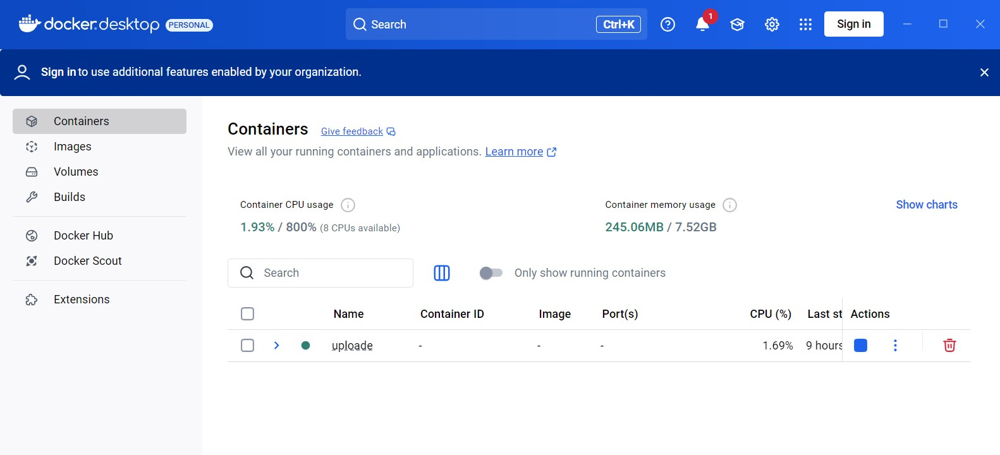

# 📁 Upload de Fichiers en Chunks avec Django, React et Docker

Ce projet permet d’uploader de gros fichiers de manière efficace en les découpant en *chunks* (morceaux), grâce à une application **Django (backend)** et **React (frontend)**, le tout conteneurisé avec **Docker**.

---

## 🔧 Stack technique

- ⚙️ **Backend** : Django + Django REST Framework
- 🎨 **Frontend** : React + axios
- 🐳 **Docker** : pour faciliter le déploiement local

---

## 🚀 Installation et Lancement

### 1. Cloner le dépôt

```bash
git clone https://github.com/hlimabenfadhel/Upload-de-Fichier.git
cd Upload-de-Fichier-en-Chunks
```

### 2. Construire et lancer l'application avec Docker Compose

```bash
docker-compose up --build
```
---

## 🚀 Lancer l'application
Une fois les conteneurs démarrés, vous pouvez accéder à l'application via les liens suivants :

Frontend (React) : http://localhost:3000

Backend (API Django) : http://localhost:8000

## 🖼️ Docker Desktop


## 🎬 Vidéo Démo
Téléchargez et visionnez la vidéo démo : [demo.mp4](./demo.mp4)
